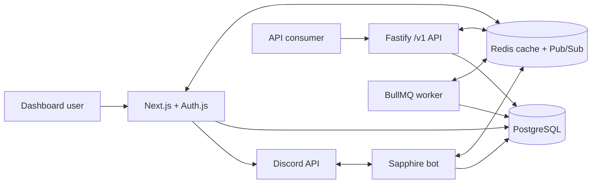

# SufBot

SufBot is a TypeScript-first, multi-tenant Discord bot and server-management platform
owned by [MRsuffix](https://github.com/MRsuffixx). This repository is the production
foundation for the bot, dashboard, API, workers, authorization model, and operations
tooling behind [sufbot.tr](https://sufbot.tr).

The initial release intentionally emphasizes isolation, security, and extension points
over a large command count. It is designed to grow into sharded bot processes,
additional modules, analytics, and premium capabilities without collapsing package
boundaries.

## Architecture



Applications:

- `apps/bot` — Sapphire/discord.js commands, interactions, runtime authorization, and
  distributed configuration refresh.
- `apps/web` — Next.js App Router dashboard, Auth.js Discord OAuth, server actions, and
  public product pages.
- `apps/api` — versioned Fastify API with API-key and signed internal-service
  authentication.
- `apps/worker` — idempotent BullMQ job execution, retry tracking, and dead-letter
  handling.

Shared packages cover Prisma, configuration, authentication, authorization, Discord
module metadata, caching, queues, logging, API signing, localization, validation, and
errors. See [the architecture guide](docs/architecture.md).

## Technology

- Node.js 24, TypeScript 6, pnpm workspaces, Turborepo
- discord.js 14 and Sapphire Framework 5
- Next.js 16, React 19, Tailwind CSS 4, shadcn-style primitives, Auth.js 5
- Fastify 5, Zod 4, OpenAPI
- PostgreSQL 17, Prisma 7
- Redis 8, BullMQ 5
- Pino, Vitest, Playwright, ESLint, Prettier
- Multi-stage Docker images and GitHub Actions

## Quick start

Prerequisites: Node.js 24+, pnpm 11.9.0, Docker with Compose, and a Discord
application.

```bash
corepack enable
corepack prepare pnpm@11.9.0 --activate
pnpm install
cp .env.example .env
docker compose up -d postgres redis
pnpm db:migrate
pnpm db:seed
pnpm dev
```

On PowerShell, use `Copy-Item .env.example .env` instead of `cp`.

Generate secrets before editing `.env`:

```bash
openssl rand -base64 48
openssl rand -base64 32
```

Use the 48-byte outputs for `AUTH_SECRET`, `INTERNAL_API_SECRET`, and
`WEBHOOK_SIGNING_SECRET`. Generate separate 32-byte outputs for `ENCRYPTION_KEY` and
`SESSION_ENCRYPTION_KEY`; those two values must decode to exactly 32 bytes. Never
reuse production secrets in development or CI.

The services start at:

- Dashboard: `http://localhost:3000`
- API: `http://localhost:3001`
- Development OpenAPI UI: `http://localhost:3001/documentation`
- API liveness/readiness: `/v1/health` and `/v1/ready`

The default configuration deliberately does not register Discord commands globally.
Set `discord.developmentGuildIds` in a local `config.development.json` for immediate
guild-scoped registration, or explicitly enable global registration when releasing.

## Discord Developer Portal

Create one Discord application and configure:

1. Under OAuth2, add:
   `http://localhost:3000/api/auth/callback/discord` and
   `https://sufbot.tr/api/auth/callback/discord`.
2. The dashboard requests only `identify` and `guilds`.
3. Under Bot, enable the Server Members privileged intent. The code requests only
   `Guilds` and `GuildMembers`.
4. Install with the `bot` and `applications.commands` scopes. The current minimal
   permission integer is `1099511629952` (`Moderate Members`, `View Audit Log`, and
   `Send Messages`).
5. Put the immutable application ID, client secret, and bot token in `.env`. Put
   immutable owner/developer Discord user IDs in the matching allowlists; never
   authorize by username.

Example development installation URL:

```text
https://discord.com/oauth2/authorize?client_id=YOUR_CLIENT_ID&permissions=1099511629952&integration_type=0&scope=bot+applications.commands
```

More detail is in [the Discord OAuth guide](docs/discord-oauth.md).

## Configuration

Secrets and environment-specific private endpoints belong in `.env`. Editable,
non-secret product behavior belongs in `config.json`. Both are validated at startup;
invalid or missing required values stop the affected service before it listens.

Optional `config.development.json`, `config.test.json`, and `config.production.json`
files are deep-merged over `config.json`. They must never contain secrets.
[Configuration reference](docs/configuration.md).

## Commands and modules

The General module provides `/ping`, `/help`, `/botinfo`, `/serverinfo`,
`/userinfo`, `/settings`, `/config view`, `/config set-language`, and the restricted
`/admin reload-config` flow. The Moderation module provides `/timeout`.

The examples also exercise a user context menu, autocomplete, buttons, a select menu,
and a modal. Each command goes through centralized runtime policy checks for tenant,
role, Discord user/bot permissions, module status, cooldown, feature flag, and
premium requirements.

## Development commands

| Command | Purpose |
| --- | --- |
| `pnpm dev` | Build shared packages and run all applications in watch mode |
| `pnpm build` | Generate Prisma and build the complete monorepo |
| `pnpm format:check` | Verify formatting |
| `pnpm lint` | Run strict ESLint checks |
| `pnpm typecheck` | Type-check every package and application |
| `pnpm test` | Run unit, API, and available database integration tests |
| `pnpm test:e2e` | Run Playwright dashboard smoke tests |
| `pnpm db:migrate` | Create/apply a local development migration |
| `pnpm db:deploy` | Apply checked-in migrations non-interactively |
| `pnpm db:seed` | Enable initial platform feature flags |
| `pnpm docker:up` | Start PostgreSQL and Redis |
| `pnpm docker:down` | Stop local containers without deleting volumes |
| `pnpm security:audit` | Fail on high/critical dependency advisories |

Set `TEST_DATABASE_URL` to include the PostgreSQL-backed tenant and transaction tests.
Without it those tests are explicitly skipped; unit and API-boundary tests still run.

## Docker and production

For a complete local container run:

```bash
docker compose up -d postgres redis
docker compose --profile application run --rm migrate
docker compose --profile application up -d --build api web bot worker
```

Production uses the same service images with `docker-compose.prod.yml`, private
PostgreSQL/Redis networking, externally managed secrets, TLS termination, and a
one-off migration step:

```bash
docker compose -f docker-compose.yml -f docker-compose.prod.yml \
  --profile application run --rm migrate
docker compose -f docker-compose.yml -f docker-compose.prod.yml \
  --profile application up -d api web bot worker
```

Expose only web port 3000 and API port 3001 through the reverse proxy. Never expose
PostgreSQL or Redis publicly. Coolify setup, backups, rollout order, and rollback
procedures are documented in [deployment](docs/deployment.md).

## Security posture

Security controls include server-side guild verification, explicit tenant filters,
encrypted OAuth tokens, revocable sessions, same-origin mutation checks, signed
internal requests with nonce replay protection, API-key hashing/scopes, rate limits,
body/response/time bounds, CSP and Helmet headers, Pino redaction, transactional
audits, optimistic concurrency, cache namespaces, validated queue payloads, job
idempotency, non-root containers, a committed lockfile, and CI dependency auditing.

No software is completely secure. Review [SECURITY.md](SECURITY.md), the
[threat model](docs/threat-model.md), and the
[authorization model](docs/authorization.md) before operating a public deployment.

## Repository map

```text
apps/             bot, web, API, and worker runtimes
packages/         shared domain and infrastructure libraries
infrastructure/   container, monitoring, and operational support
tests/            unit, API, integration, and browser tests
docs/             architecture and operator runbooks
config.json       validated non-secret behavior
```

## Current scope

The foundation does not yet include billing, full analytics aggregation, a public
API-key lifecycle UI, sharding orchestration, or large feature modules such as
automod, tickets, leveling, welcome, and giveaways. Sentry is an optional validated
endpoint but no vendor adapter is enabled. A live Discord login, bot connection, and
production deployment require operator-owned credentials and infrastructure.

Recommended next modules are automod and logging first, then welcome/reaction roles,
tickets, analytics aggregation, and premium entitlement integration.

See [CONTRIBUTING.md](CONTRIBUTING.md) before changing authorization, schemas, or
runtime configuration. Licensed under [MIT](LICENSE).
