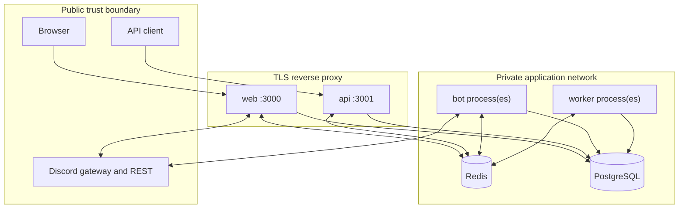
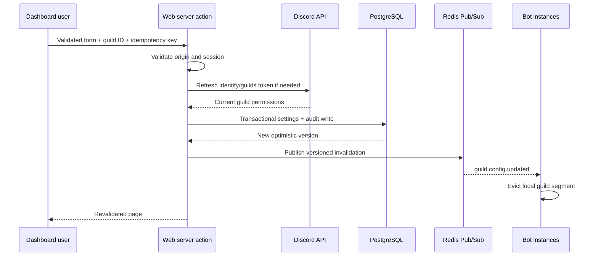

# Architecture

## Design goals

SufBot is separated into independently scalable stateless runtimes around PostgreSQL as the source
of truth and Redis as an optimization/coordination layer. Shared packages contain domain contracts;
application packages contain delivery adapters. No runtime imports another runtime.

## Runtime responsibilities

| Runtime | Owns                                                             | Does not own                     |
| ------- | ---------------------------------------------------------------- | -------------------------------- |
| Web     | OAuth, sessions, HTML, dashboard authorization and mutations     | public API keys, Discord gateway |
| API     | `/v1`, API-key scopes, signed internal endpoints, probes/OpenAPI | browser OAuth sessions           |
| Bot     | gateway state, commands/interactions, runtime command policy     | dashboard identity               |
| Worker  | retryable/offline jobs, durable outcomes, dead letters           | synchronous user responses       |

PostgreSQL is authoritative. Redis failure can degrade cache reads and invalidation, but never
grants access. Replay and duplicate-mutation claims deliberately fail closed when Redis cannot prove
uniqueness.

## Package boundaries

- `shared`: safe errors, crypto, IDs, Zod input schemas, localization.
- `config`: validated `config.json`, environment schemas, overrides.
- `database`: generated Prisma client, singleton lifecycle, repositories, audits.
- `auth`: encrypted OAuth persistence, live Discord guild grants, internal signing.
- `permissions`: deterministic policy decisions with no network side effects.
- `discord`: module definitions and command metadata.
- `cache`: local/Redis cache, stampede coalescing, Pub/Sub invalidation.
- `queue`: queue names, payload schemas, retry/dedup defaults.
- `logger`: structured Pino factory and redaction.
- `api-client`: signed internal-service requests.

The dependency direction is from applications toward packages and from specialized packages toward
foundational packages. Runtime applications never depend on each other.

## Guild configuration change

The Discord permission result is cached only as a short-lived grant. Sensitive dashboard operations
call the live-refresh flow before mutation. Every database query still scopes the requested tenant
explicitly.

## Command execution

Sapphire loads a command derived from `SufBotCommand`. The `Authorized` precondition retrieves
central metadata and evaluates, in order: guild requirement, platform owner/developer role, user/bot
Discord permissions, enabled module, plan entitlement, feature flag, custom command permissions, and
cooldown. Discord's UI permission hints are not treated as authorization.

Commands receive correlation identifiers from interaction IDs, use ephemeral failures where
appropriate, write usage/audit records, and return an opaque error reference instead of a stack
trace.

## Scaling

- Web, API, and workers may scale horizontally behind a proxy.
- Bot sharding metadata is already configuration-driven; production orchestration should assign
  non-overlapping shard sets and capacity-test gateway concurrency.
- Redis Pub/Sub invalidates every bot/web/API process; TTL bounds stale data if an invalidation is
  missed.
- Worker concurrency is per process. Durable `(queueName, idempotencyKey)` uniqueness prevents
  duplicate effects across processes.
- PostgreSQL pool limits are intentionally small per process. Recalculate total connections before
  changing replica counts.

## Failure behavior

| Failure                           | Behavior                                                         |
| --------------------------------- | ---------------------------------------------------------------- |
| PostgreSQL unavailable            | readiness fails; stateful requests/jobs fail safely              |
| Redis cache unavailable           | reads fall back to PostgreSQL; uniqueness claims fail closed     |
| Discord REST unavailable          | bounded refresh request aborts; dashboard requires retry/re-auth |
| invalid config/env                | process stops before listening/logging in                        |
| malformed queue payload           | Zod rejects it; retry/dead-letter tracking applies               |
| stale optimistic version          | transaction returns a conflict; no partial audit/state write     |
| invalid internal signature/replay | request is denied and authorization failure is audited           |

## Extension path

Add new feature modules in `packages/discord`, validated persistence in the database package, policy
names in `permissions`, and application adapters only where needed. Large modules should own their
queue schemas and service layer but use the shared authentication, audit, cache, error, and logging
conventions.
