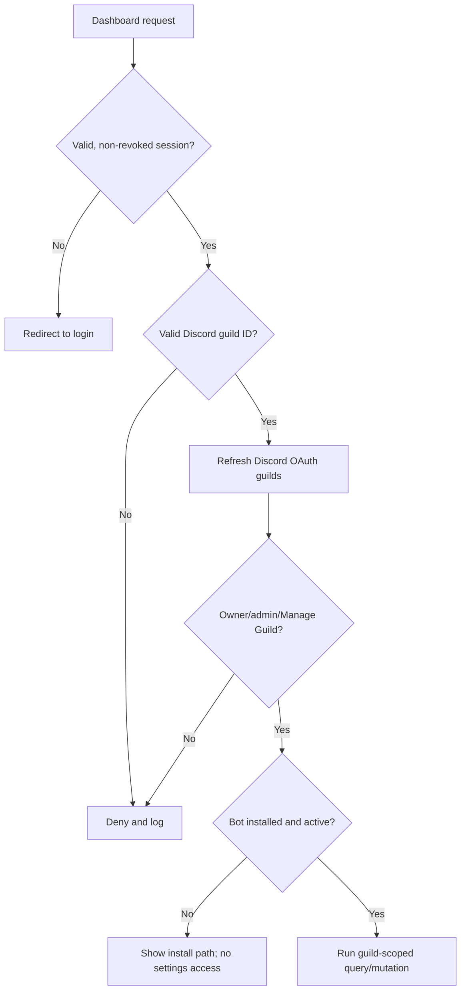

# Authorization

Authentication establishes identity; it never grants tenant access by itself. SufBot
combines platform role, a current Discord permission grant, bot-installation state,
explicit scopes, module availability, and command policy.

## Roles and authority

Platform roles are ordered only for explicitly platform-scoped operations:

```text
OWNER > DEVELOPER > ADMIN > USER
```

Owner/developer/admin membership comes from immutable Discord IDs in environment
allowlists and is synchronized to `User.platformRole` at login. Usernames and display
names are never authorization inputs.

Guild authority is independent:

- current guild owner;
- current Discord `Administrator` or `Manage Guild`;
- an explicitly modeled custom `guild.manage` permission;
- a platform administrator for policy operations that deliberately allow it.

Elevated platform roles do not make browser-provided guild IDs trustworthy. The server
still loads the guild and scopes all data access to it.

## Dashboard decision



Layouts protect rendering and server actions repeat authorization for mutations. This
prevents a user from bypassing a hidden/disabled UI control by posting directly.
Sensitive changes claim a unique mutation ID and write state plus audit in one
transaction.

## API decision

Public API routes require a syntactically valid bearer token whose hash matches an
active, unexpired, non-revoked `ApiKey`. Middleware checks:

1. user is active;
2. required scope or wildcard is present;
3. optional key-level guild binding matches the route;
4. a fresh `GuildAccessGrant` exists for the same user/guild;
5. the route query uses that exact guild ID.

Authentication and authorization failures return a safe envelope and create a
best-effort redacted failure audit. API key creation/revocation is intentionally a
future administrative surface; no endpoint creates a key in this foundation.

Internal endpoints use HMAC-signed requests. The signature covers timestamp, nonce,
HTTP method, exact path, and SHA-256 body hash. Timestamp skew is bounded and Redis
atomically claims the nonce. Network location alone is not authority.

## TOCTOU policy

Discord permissions may change between a check and an external action. Dashboard
writes refresh permissions immediately before the local transaction. Bot commands use
the gateway interaction member permissions at execution time. Moderation then relies
on Discord to enforce role hierarchy and bot permissions atomically at its API.

For future long-running workflows, include the actor/policy snapshot for audit but
re-authorize immediately before every security-sensitive effect.

## Tenant-safe data access checklist

- Parse the guild snowflake at the server boundary.
- Resolve the authenticated internal user independently.
- Obtain a current grant for the same `(userId, guildId)`.
- Include `guildId` in every read/update/delete predicate.
- Do not load by a globally unique child record ID and compare afterward.
- Use compound unique keys for guild-owned natural identities.
- Add success and negative cross-guild tests.
- Write failure audits without storing tokens, headers, or raw IP addresses.

See [permissions](permissions.md) for command policy details and
[the threat model](threat-model.md) for residual risks.
