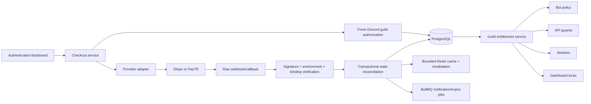

# Billing architecture

SufBot billing is guild-scoped and provider-independent. PostgreSQL is authoritative. A browser
return, provider metadata, Redis value, or queue execution cannot activate Premium.

## Domain boundaries

- `BillingPlan` is the persisted snapshot of validated product configuration.
- `BillingCustomer` maps one internal purchaser to one provider customer.
- `GuildSubscription` binds a purchaser, exactly one Discord guild, a plan snapshot, and provider
  identifiers.
- `PaymentTransaction` records financial attempts and outcomes; it is not the entitlement.
- `BillingProviderEvent` is the signature-verified, deduplicated event ledger.
- `GuildEntitlement` answers feature access independently of provider state.
- `CheckoutSession` binds a short-lived nonce hash, purchaser, guild, environment, price, and
  provider session.
- `BillingAuditEvent`, `BillingNotification`, and `BillingRiskBlock` remain separate from financial
  state.

## State and entitlement rules

The state machine permits only reviewed transitions. `ACTIVE` grants only when the latest verified
payment succeeded and the verified period end is in the future. `GRACE_PERIOD` grants only until its
bounded grace end. A scheduled cancellation uses `CANCELLED` plus `cancellationStatus=SCHEDULED`; it
grants until the verified period end. `SUSPENDED`, `EXPIRED`, `DISPUTED`, and `REFUNDED` do not
grant.

Reconciliation version-checks the subscription, updates payment and subscription state, upserts or
revokes all versioned entitlements, writes an audit event, and increments the guild entitlement
version in one PostgreSQL transaction. Cache invalidation and jobs happen only after commit.

## Guild and purchaser binding

Checkout requires a current Discord `Manage Guild`, `Administrator`, or owner grant and an installed
bot. The server creates all IDs, amount, currency, URLs, nonce, and provider metadata. Provider
events must match the stored checkout, purchaser, guild, plan, environment, provider session, and
amount snapshot. Billing ownership is not transferred when Discord ownership changes.

## Provider adapters

`BillingProvider` contains provider capability checks, checkout, cancellation/resume, management
session, raw callback verification, authoritative retrieval, and reconciliation. Stripe and PayTR
objects do not leave their adapters.

- Stripe uses an immutable configured Price and provider-managed recurrence.
- PayTR uses only the documented iFrame initial payment in explicit `manual_renewal` mode. It does
  not fabricate a subscription. Automated recurrence stays unavailable until an approved merchant
  card-storage/recurrence implementation exists.
