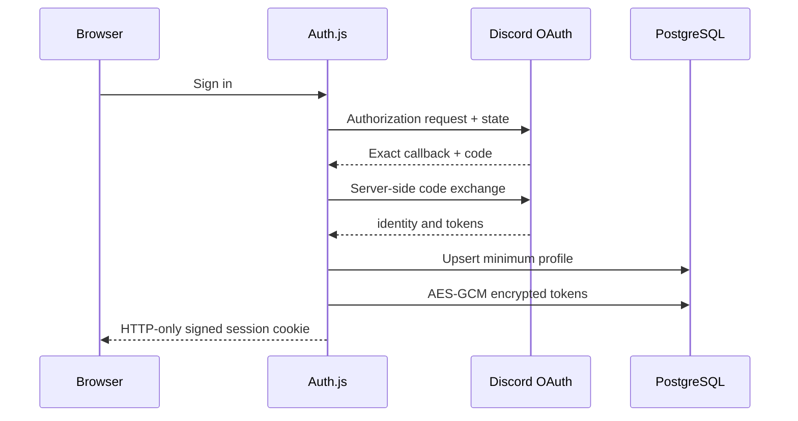

# Discord OAuth and installation

## Portal configuration

Use one Discord application for a production environment. Separate applications are
recommended for development/staging to prevent callback and token confusion.

OAuth redirect URIs must match exactly:

- `http://localhost:3000/api/auth/callback/discord`
- `https://sufbot.tr/api/auth/callback/discord`

Dashboard scopes are `identify guilds`. Installation scopes are
`bot applications.commands`. Enable the Server Members privileged intent because the
bot requests `GuildMembers`; keep unused intents disabled.

## Authentication flow

Auth.js owns OAuth state/CSRF processing. Redirects are constrained to the configured
base origin or relative paths. Tokens remain server-side. The database stores only the
Discord ID, display name, avatar hash, role, token envelope, scopes, and expiry needed
for access refresh.

## Guild access

Discord's guild response provides ownership, a permission bitfield, and installed
guild information. The server persists short-lived `GuildAccessGrant` rows, never a
browser assertion. A guild is manageable only when the user is the owner, has
`Administrator`/`Manage Guild`, or has an explicitly accepted platform policy.

Before a sensitive dashboard write:

1. require a valid, non-revoked server session;
2. load/decrypt the server-side OAuth credential;
3. refresh it at Discord when near expiry;
4. fetch the current `users/@me/guilds` list with a bounded timeout;
5. synchronize short-lived grants;
6. require the requested guild's grant and bot-installation state;
7. scope the transactional write to that guild.

Stale or revoked Discord access causes re-authentication instead of falling back to an
old client-side guild list.

## Token encryption and rotation

`ENCRYPTION_KEY` must be a base64-encoded 32-byte key. AES-256-GCM uses a fresh random
96-bit nonce and authentication tag for every value. The envelope contains a version
so a future key identifier/rotation format can be introduced.

The current foundation supports replacement through re-authentication but not online
multi-key rotation. Before rotating at scale, add a keyring with active/legacy key IDs,
dual-read/single-write behavior, and an audited background re-encryption job.

Revoking all sessions increments `User.sessionVersion`, revokes stored session rows,
deletes the OAuth credential, and signs the browser out.

## Bot installation

The current least-privilege permission integer is `1099511629952`. Review permissions
again whenever a module begins to require more. Do not request `Administrator`.
Runtime commands re-check both actor and bot permission bitfields even when Discord
command metadata hides or disables a command.
